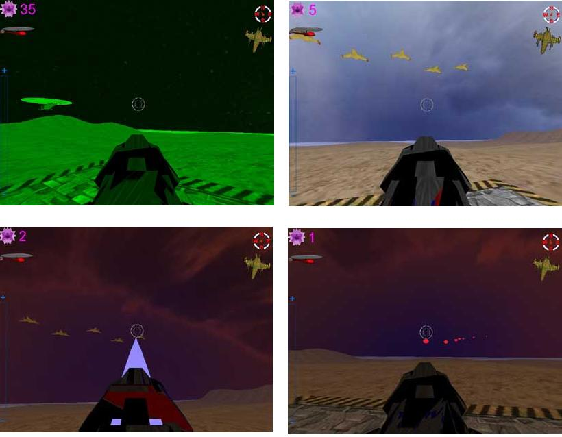

## Gameproject

### Description

Hi all...This is a Really DX8 game (not completd yet)

I made this game with VB6 while i was learning DX8 in about 1 year

*** *** * :-) If I get more than 7 Excellent votes for this code

I will put the completed game code as soon i finish it with no mathimatical errors

&amp; I will comment it in English language

*** *** *

jaber.al-ani@outlook.com

### More Info
 

             |
---                |---
**Submitted On**   |2006-08-24 16:45:06
**By**             |[jaber\_al ani](https://github.com/Planet-Source-Code/PSCIndex/blob/master/ByAuthor/jaber-al-ani.md)
**Level**          |Advanced
**User Rating**    |5.0 (65 globes from 13 users)
**Compatibility**  |VB 6\.0
**Category**       |[DirectX](https://github.com/Planet-Source-Code/PSCIndex/blob/master/ByCategory/directx__1-44.md)
**World**          |[Visual Basic](https://github.com/Planet-Source-Code/PSCIndex/blob/master/ByWorld/visual-basic.md)
**Archive File**   |[Gameprojec2016368282006\.zip](https://github.com/Planet-Source-Code/jaber-al-ani-gameproject__1-66399/archive/master.zip)

